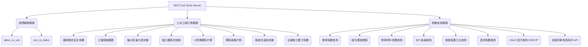
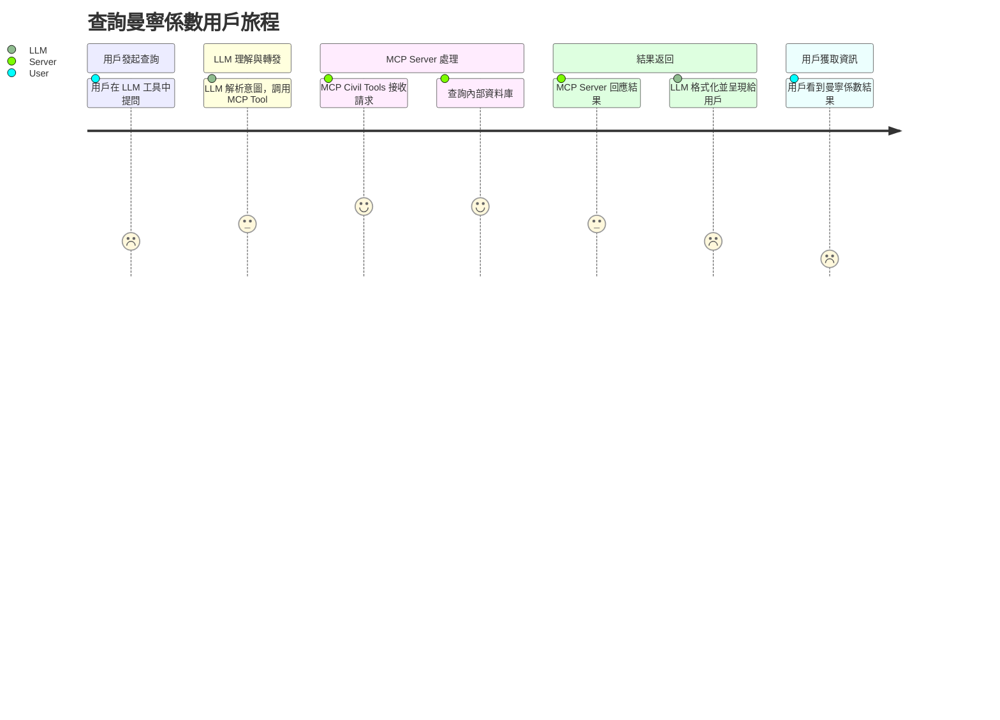

# 產品需求文檔 (PRD)

## 1. 文檔資訊

### 1.1 版本歷史

| 版本 | 日期       | 修改人 | 描述                                     |
| ---- | ---------- | ------ | ---------------------------------------- |
| 1.0  | YYYY-MM-DD | Trae AI | 初始版本，基於現有專案分析自動生成。 |

### 1.2 文檔目的

本文檔旨在描述「MCP Civil Tools」專案的當前狀態、功能與架構，並作為後續功能調整、修改與新增的指導性文件。

### 1.3 相關文檔引用

*   [專案 README.md](../README.md)
*   (其他待補充，例如設計文檔、API 文檔等)

## 2. 產品概述

### 2.1 產品名稱與定位

*   **產品名稱**: MCP Civil Tools
*   **產品定位**: 一個基於 MCP 協議的 Python 伺服器，提供土木工程相關的查詢與計算功能，旨在整合至大型語言模型 (LLM) 工具或 AI 應用中，實現透過自然語言進行專業計算。

### 2.2 產品願景與使命

*   **產品願景**: (待用戶填寫)
*   **產品使命**: (待用戶填寫)

### 2.3 價值主張與獨特賣點 (USP)

*   **價值主張**: 簡化土木工程專業計算的門檻，讓非專業人士也能透過自然語言交互快速獲得計算結果。
*   **獨特賣點**: 
    *   整合水土保持技術規範 (2023.05.04)。
    *   支援自然語言輸入進行查詢與計算。
    *   提供台灣地區經緯度與 UTM/TWD97 座標轉換功能。
    *   易於整合至現有的 AI 應用生態。

### 2.4 目標平台列表

*   **主要目標平台**: 支援 MCP 協議的客戶端應用 (例如 LLM 工具、Claude Desktop 等)
*   **次要/潛在平台**: (待用戶填寫，例如 Web 服務、桌面應用等)

### 2.5 產品核心假設

*   用戶具備基礎的土木工程概念，或能夠透過 LLM 的輔助理解輸入參數與輸出結果。
*   MCP 協議是主要的交互方式。
*   伺服器部署環境穩定。

### 2.6 商業模式概述

*   (目前專案未體現明確商業模式，待用戶補充)

## 3. 用戶研究 (基於現狀與未來擴展)

### 3.1 目標用戶畫像

*   **主要用戶**: 
    *   使用 LLM 工具的土木工程師、水土保持技師。
    *   需要快速進行土木相關計算的學生或研究人員。
    *   AI 應用開發者，需要整合土木工程計算能力到其應用中。
*   **3.1.1 人口統計特徵**: (待用戶補充更詳細畫像)
*   **3.1.2 行為習慣與偏好**: 
    *   習慣使用數位工具進行查詢和計算。
    *   期望快速獲得準確的結果。
    *   對於複雜的計算過程，傾向於使用自動化工具。
*   **3.1.3 核心需求與痛點**:
    *   **現有功能解決**: 快速查詢規範參數、執行標準化計算、座標轉換。
    *   **未來可解決**: (待用戶補充，例如更複雜的工程模型分析、視覺化結果呈現等)
*   **3.1.4 動機與目標**: 提高工作效率，減少手動查表和計算的錯誤。

### 3.2 用戶場景分析

*   **3.2.1 核心使用場景詳述**:
    *   **場景1**: 工程師在進行初步設計時，需要快速查詢某種材料的曼寧係數。
        *   用戶通過 LLM 工具輸入：「查詢混凝土的曼寧係數」。
        *   MCP Civil Tools 伺服器接收請求，返回曼寧係數及最大容許流速。
    *   **場景2**: 學生在學習邊坡穩定分析時，需要計算特定條件下的安全係數。
        *   用戶通過 AI 應用輸入邊坡參數（坡度、單位重、摩擦角、凝聚力等）。
        *   MCP Civil Tools 伺服器計算並返回安全係數及相關說明。
    *   **場景3**: 開發者需要將 TWD97 座標轉換為經緯度以在地圖上標示。
        *   應用程式調用 `utm_to_latlon` API。
        *   MCP Civil Tools 伺服器返回轉換後的經緯度字串。
*   **3.2.2 邊緣使用場景考量**: (待用戶補充)

### 3.3 用戶調研洞察

*   (提示用戶此部分可補充實際用戶調研結果)

## 4. 市場與競品分析 (基於現狀與未來擴展)

### 4.1 市場規模與增長預測

*   (待用戶填寫，可針對土木工程軟體、AI輔助設計等領域分析)

### 4.2 行業趨勢分析

*   AI 技術在工程領域的應用日益廣泛。
*   自然語言交互成為新的趨勢。
*   對快速、準確、自動化計算工具的需求增加。

### 4.3 競爭格局分析

*   **4.3.1 直接競爭對手詳析**: (可能包括其他工程計算軟體、線上計算工具等，待用戶分析)
*   **4.3.2 間接競爭對手概述**: (例如傳統的查表手冊、Excel 計算表等)

### 4.4 競品功能對比矩陣

| 功能點         | MCP Civil Tools | 競品 A | 競品 B | 備註     |
| -------------- | --------------- | ------ | ------ | -------- |
| 座標轉換       | ✅               |        |        |          |
| 曼寧係數查詢   | ✅               |        |        |          |
| 土壓力係數計算 | ✅               |        |        |          |
| 邊坡穩定分析   | ✅               |        |        |          |
| 土壤侵蝕計算   | ✅               |        |        |          |
| 逕流量計算     | ✅               |        |        |          |
| 擋土牆檢核     | ✅               |        |        |          |
| 自然語言交互   | ✅               |        |        | 核心優勢 |
| ...            |                 |        |        |          |

### 4.5 市場差異化策略

*   專注於與 LLM 的整合，提供自然語言交互的便捷性。
*   基於最新的台灣水土保持技術規範。
*   開源，易於擴展和客製化。

## 5. 產品功能需求

### 5.1 功能架構與模塊劃分

(基於 `src/mcp_server.py` 和 `src/util.py` 分析)

### 5.2 核心功能詳述

#### 5.2.1 座標轉換 (latlon_to_utm, utm_to_latlon)

*   **功能描述**: 
    *   作為 [用戶], 我可以 [將經緯度座標轉換為 UTM/TWD97 座標], 以便 [在台灣地區的工程專案中使用統一的座標系統]。
    *   作為 [用戶], 我可以 [將 UTM/TWD97 座標轉換為經緯度座標], 以便 [在通用地圖服務上定位或與國際數據交換]。
*   **用戶價值**: 提供台灣地區常用的座標系統轉換，方便工程應用。
*   **功能邏輯與規則**: 
    *   `latlon_to_utm`: 輸入緯度、經度，可選大地基準 (預設 TWD97)。輸出 X,Y 字串 (小數點後4位)。TWD97 時，zone 固定為 "TM2-121"。
    *   `utm_to_latlon`: 輸入 X, Y 座標，可選 zone、是否南半球、大地基準 (預設 TWD97)。輸出 "緯度,經度" 字串 (小數點後15位)。TWD97 時，zone 預設 "TM2-121"。
    *   使用 `pyproj` 庫進行轉換。
    *   錯誤處理：若轉換失敗，返回包含錯誤訊息的 JSON。
*   **交互簡述**: 透過 MCP tool API 調用。
*   **數據需求**: 輸入經緯度或 UTM/TWD97 座標，大地基準參數。
*   **技術實現簡述**: Python, `pyproj` 庫。
*   **現有驗收標準**: 
    *   輸入合法的經緯度 (例如 23.5, 120.5)，datum="TWD97"，應返回正確的 TWD97 X,Y 座標字串。
    *   輸入合法的 TWD97 X,Y 座標，datum="TWD97"，應返回正確的經緯度字串。
    *   輸入無效參數，應返回包含錯誤提示的 JSON。

#### 5.2.2 曼寧係數查詢 (get_manning_n)

*   **功能描述**: 作為 [用戶], 我可以 [查詢常見材料的曼寧係數及最大容許流速], 以便 [進行水力計算與渠道設計]。
*   **用戶價值**: 快速獲取水土保持技術規範中的標準參數。
*   **功能邏輯與規則**: 
    *   輸入材料名稱 (字串)。
    *   從預定義的資料中查找對應材料的描述、曼寧係數 (n) 和最大容許流速範圍 (v_range)。
    *   若找到，返回包含材料、n、v_range 的 JSON。
    *   若未找到，返回支援查詢的材料列表。
*   **交互簡述**: 透過 MCP tool API 調用。
*   **數據需求**: 材料名稱。
*   **技術實現簡述**: Python, 內部資料查詢。
*   **現有驗收標準**: 
    *   輸入 "混凝土"，應返回其曼寧係數和流速範圍。
    *   輸入不存在的材料，應返回支援的材料列表。

#### 5.2.3 邊坡穩定安全係數計算 (calc_slope_stability)

*   **功能描述**: 作為 [用戶], 我可以 [輸入邊坡參數計算其安全係數], 以便 [評估邊坡的穩定性]。
*   **用戶價值**: 快速進行邊坡穩定性初步評估。
*   **功能邏輯與規則**: 
    *   輸入參數：坡度 (度)、土壤單位重 (kN/m³)、內摩擦角 (度)、凝聚力 (kPa)、地下水位高度 (m, 相對於坡腳，預設0)，計算方法 (字串，預設 "簡化法")。
    *   基於所選方法 (目前主要為簡化 Bishop 法或類似方法) 計算安全係數 (Fs)。
    *   判斷是否合格 (Fs >= 規範要求值，例如 1.5 或 1.2)。
    *   返回包含 Fs、方法、是否合格、依據規範、說明、輸入參數、公式、計算過程的 JSON。
*   **交互簡述**: 透過 MCP tool API 調用。
*   **數據需求**: 坡度、單位重、摩擦角、凝聚力、地下水位、計算方法。
*   **技術實現簡述**: Python, 相關工程計算公式。
*   **現有驗收標準**: 
    *   輸入一組典型參數，應返回合理的安全係數及計算過程。
    *   (需要更多具體驗收案例)

(其他核心功能如土壤侵蝕、逕流量計算等，結構類似，待詳細補充)

### 5.3 次要功能描述

*   主被動土壓力係數計算 (calc_active_earth_pressure, calc_passive_earth_pressure)
*   擋土牆穩定檢核 (check_retaining_wall)
*   植生護坡建議 (suggest_vegetation_slope)
*   常用材料參數查詢 (query_material_params)
*   IDF 曲線查詢 (query_idf_curve)
*   坡面保護工法查詢 (list_slope_protection_methods)
*   U型溝鋼筋計算 (calculate_u_channel_rebar)
*   鋼筋重量計算 (calculate_rebar_weight)
*   逕流係數查詢 (get_runoff_coefficient)
*   USLE 因子 R/K/C/P 查詢 (query_r_factor_tool, query_k_factor_tool, query_c_factor_tool, query_p_factor_tool)
*   各類支援清單查詢 API (如 list_supported_materials 等)

(每個次要功能也應有類似核心功能的描述結構，此處從略)

### 5.4 未來功能儲備 (Backlog)

*   **[待規劃功能模塊A]**: (例如：更詳細的擋土牆設計工具)
    *   初步功能描述: (用戶可填寫)
    *   預期用戶價值: (用戶可填寫)
*   **[待規劃功能模塊B]**: (例如：沉陷量計算工具)
    *   初步功能描述: (用戶可填寫)
    *   預期用戶價值: (用戶可填寫)

## 6. 用戶流程與交互設計指導

### 6.1 核心用戶旅程地圖

(以查詢曼寧係數為例)

### 6.2 關鍵流程詳述與狀態轉換圖

*   (針對如邊坡穩定計算等包含多步驟或條件判斷的流程，可使用狀態圖，待補充)

### 6.3 對設計師 (UI/UX Agent) 的界面原型參考說明和要求

*   由於本產品主要是後端伺服器，直接的 UI/UX 較少。
*   若未來有獨立的 Web UI 或客戶端，應考慮：
    *   輸入參數的清晰標示與單位說明。
    *   計算結果的直觀呈現，重要指標突出顯示。
    *   錯誤提示友好，引導用戶修正輸入。
    *   提供計算過程或公式參考。

### 6.4 交互設計規範與原則建議

*   **API 設計**: 
    *   遵循 MCP 協議規範。
    *   API 名稱清晰易懂，反映功能。
    *   輸入參數名明確，單位清晰 (透過註解或文檔說明)。
    *   回傳結果結構化 (JSON)，包含成功狀態、數據和訊息。
    *   錯誤處理機制完善，提供有意義的錯誤訊息。
    *   對於查詢類 API，當查無資料時，應提示可用的查詢項。

## 7. 非功能需求

### 7.1 性能需求

*   **現狀**: (待評估，多數計算應在秒級完成)
*   **未來期望**: 
    *   單一 API 調用響應時間 < 1 秒 (95th percentile)。
    *   (待用戶定義並發用戶數等指標)

### 7.2 安全需求

*   **現狀**: 
    *   無用戶認證機制 (依賴 MCP 客戶端環境)。
    *   輸入參數未做嚴格的邊界檢查 (依賴 Python 型別提示和 FastAPI)。
*   **未來需增強**: 
    *   考慮對輸入參數進行更嚴格的驗證，防止潛在的注入或異常。
    *   (若涉及敏感數據存儲或傳輸，需補充加密等要求)

### 7.3 可用性與可訪問性標準

*   **API 可用性**: 
    *   文檔清晰，易於開發者理解和集成。
    *   錯誤訊息明確，有助於排查問題。
*   **可訪問性**: (主要針對未來可能的 UI)

### 7.4 合規性要求

*   計算結果應符合台灣現行水土保持技術規範 (2023.05.04 版本)。
*   (若涉及個人資料等，需考慮 GDPR 等法規，目前看來不適用)

### 7.5 數據統計與分析需求

*   **現狀**: 無內建的 API 調用統計。
*   **建議未來增加**: 
    *   記錄 API 調用頻次、常用功能、錯誤率等。
    *   (可整合日誌分析工具)

## 8. 技術架構考量

### 8.1 現有技術棧描述

*   **程式語言**: Python
*   **Web 框架**: FastAPI (透過 `mcp.server.fastmcp`)
*   **核心依賴**: `pyproj` (座標轉換), `pydantic` (資料驗證)
*   **部署方式**: (待用戶說明，可能是本地運行或容器化部署)

### 8.2 系統集成需求

*   主要透過 MCP 協議與客戶端 (LLM 工具等) 集成。
*   (未來可能需要與其他數據服務或 API 集成，待補充)

### 8.3 技術依賴與約束

*   依賴 Python 運行環境及 `requirements.txt` 中指定的套件版本。
*   計算邏輯的準確性依賴於 `util.py` 中實現的公式和查表數據。
*   部分計算 (如 IDF 曲線) 依賴內部存儲的數據表。

### 8.4 數據模型概述

*   主要為各計算工具的輸入參數和輸出結果的資料結構，多以 Pydantic BaseModel 或 TypedDict 形式定義 (參考 `utm_types.py` 和各工具函數的型別提示)。
*   內部查表數據 (如曼寧係數表、坡面保護工法表等) 以 Python 字典或列表形式存儲在 `util.py` 中。

## 9. 驗收標準匯總

### 9.1 功能驗收標準矩陣

| 功能模塊         | 關鍵驗收點                                     | 狀態 |
| ---------------- | ---------------------------------------------- | ---- |
| 座標轉換         | 正確轉換 TWD97 與經緯度；錯誤處理                | ✅    |
| 曼寧係數查詢     | 正確返回已知材料參數；未知材料提示列表           | ✅    |
| 邊坡穩定計算     | 輸入典型參數，輸出合理安全係數與過程             | (待驗證更多案例) |
| 土壤侵蝕計算     | 輸入典型參數，輸出合理侵蝕模數與過程             | (待驗證更多案例) |
| 集水區逕流量計算 | 輸入典型參數，輸出合理逕流量與過程               | (待驗證更多案例) |
| ...              | ...                                            |      |

### 9.2 性能驗收標準

*   (參考 7.1 性能需求，待定義具體測試案例和基線)

### 9.3 質量驗收標準

*   程式碼應有適當的註釋。
*   (建議補充單元測試覆蓋率要求，例如 > 70%)
*   無已知的嚴重 Bug。

## 10. 產品成功指標

### 10.1 關鍵績效指標 (KPIs) 定義與目標

*   **API 調用成功率**: > 99.9%
*   **平均 API 響應時間**: < 500ms
*   **用戶查詢採納率**: (若可追蹤) LLM 返回結果中，用戶對本工具提供結果的滿意度/使用頻次。
*   **功能覆蓋度**: (與水保規範相比) 已實現功能的比例。

### 10.2 北極星指標定義與選擇依據

*   **建議思考方向**: 「通過 MCP Civil Tools 成功完成的有效工程查詢/計算次數」。
*   **選擇依據**: 此指標直接反映產品核心價值被用戶使用的程度。

### 10.3 指標監測計劃

*   **數據收集**: 透過伺服器日誌記錄 API 調用情況 (請求、參數、響應時間、成功/失敗)。
*   **工具建議**: ELK Stack (Elasticsearch, Logstash, Kibana) 或 Prometheus + Grafana。
*   **報告頻率**: 每週/每月檢視 API 使用趨勢和錯誤報告。
*   **負責人**: (待用戶指定)